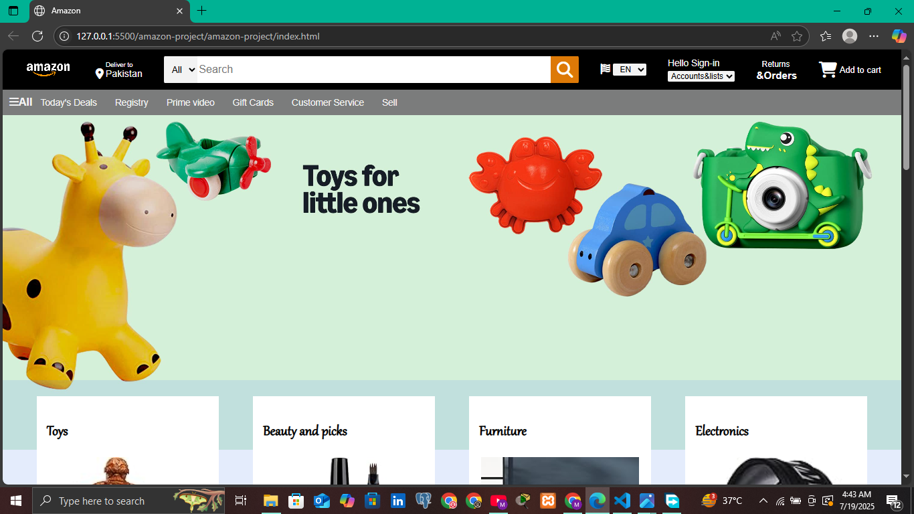

# Amazon Clone 

A front-end clone of the Amazon website built using **HTML** and **CSS**. This project demonstrates basic layout structuring, responsive design, and visual styling — all without JavaScript.

---

##  Screenshot



---

##  Live Demo

[Click here to view the live site](https://yourusername.github.io/amazon-clone/)

---

##  Built With

- HTML5
- CSS3 (Flexbox & Grid)

---

##  Features

-  Navigation Bar
-  Responsive Header with Logo & Search
-  Product Sections with Cards
-  Footer with Links

---

##  How to Run

1. Clone the repository  
   ```bash
   git clone https://github.com/momina45/amazon-clone.git
